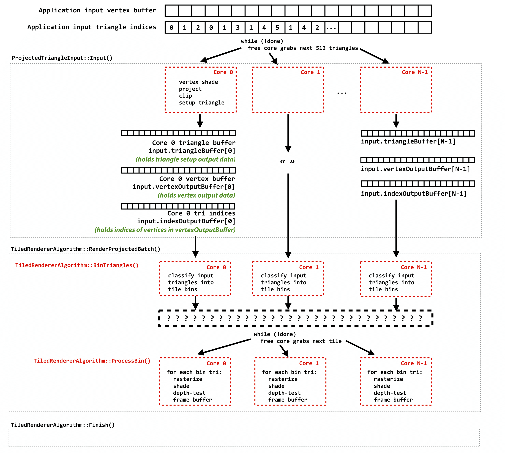

# A1: Implementing a Parallel Sort-Middle Tiled Renderer

In this assignment you are given starter code for a CPU parallel renderer. Your job is to implement a few missing parts of the rasterizer and to parallelize the renderer using a sort-middle tiled approach (a.k.a. a "tiled renderer"). You'll find this renderer (after you properly parallelize it), to be quite fast for a software CPU implementation.

#### A1.0 Due Date: Feb 2nd
#### A1.5 Due Date: Feb 16th

## Getting Started

Grab the renderer starter code above. Due to heavy use of C++11, building the code on Linux requires G++ 4.8. All Gates cluster machines had been updated to have it, but we recommend you work on the Gates 3000 machines, ghc28-49.ghc.andrew.cmu.edu.

### About the Code

The starting codebase is a basic framework for a parallel CPU-based renderer. The renderer performs shading on quad fragments as discussed in class. It is already parallelized, but in a very simple manner. Geometry work (vertex processing, triangle assembly, and clipping) is parallelized by distributing chunks of triangles across all cores, resulting in a buffer of post-clip triangles. Then, rasterization and early depth testing of these triangles is performed serially on one core, yielding a large buffer of quad fragments. This buffer is shaded in parallel using all cores. Last, the shaded quad fragments are blended into the frame buffer in serial.

This is a codebase that is written for performance, so it is not the cleanest possible academic code. (For example, SSE code is present throughout the codebase.) We have left some documentation in the parts of the renderer that you most likely need to understand and/or modify. Nonetheless you are invited to explore other parts of the codebase and feel free to ask the staff questions.

You may wish to review the diagram below, which illustrates the basic structure of the tiled version of the renderer.



### Linux Build Instructions

The codebase uses [Cmake](https://cmake.org) as its cross-platform make utility. We suggest building via an out-of-source build, which you can perform via the following steps

```
// 1. Create a build directory at the root
mkdir build

// 2. Enter the build directory
cd build

// 3. Configure the build
cmake ../Renderer

// 4. Run the generated Makefiles
make -j
```

### Running the Renderer

```
./bin/render square -mediadir /afs/cs/academic/class/15469-s22/asst1/media
```

We provide all the scene files in our ```afs/``` class space. To save typing (and decrease load time for some of the larger scenes) you may wish to locate the ```/media``` directory to a local directory, but be advise they total >1GB in space.

You may find a list of all scene files by cd-ing into the ```/media``` directory.

The result will be an output image (BMP format) that is supposed to be a rendering of a square, but ***OH NO, the image is all black!*** That leads you to Part 1 of the assignment.

## Part 1: Implementing Rasterization

The first step in the assignment is to fix the renderer by implementing a triangle rasterizer (a quad fragment generator). You will do this by implementing two functions currently stubbed out in ```Rasterizer.h```: ```RasterizeTriangle``` and ```TriangleSIMD::TestQuadFragment```.

```RasterizeTriangle``` accepts as input a region of the output image and a triangle. It must identify all 2x2 pixel blocks within this screen region that may be at least partially covered by the triangle. For each of these blocks, it should call the provided function ```processQuadFragmentFunc()```.

Part of the imeplementation of ```processQuadFragmentFunc()``` is determine if the triangle actually covers samples in this 2x2 pixel block. It does so by calling ```TriangleSIMD::TestQuadFragment```. This method accepts as input the coordinates of four screen sample points (corresponding to the 2x2 block of pixels), and outputs a bitmask indicating which of these points lies within the triangle. The expected format of the bitmask is a little non-standard, so please pay attention to the comments in the code. Also, keep in mind that your implementation of "inside triangle" should respect the rasterization edge rules discussed in class. (Conveniently, the values in ```TriangleSIMD::isOwnerEdge[i]``` will be very helpful in crafting an implementation that respects the rules.)

In order to implement these two required functions, you'll need to understand the data stored in the ```TriangleSIMD``` structure. We suggest you look at the struct's definition in ```Rasterizer.h```, the ```ProjectedTriangle``` struct definition in ```ProjectedTriangle.h```, and also the implementation of ```SetupTriangle``` in ```RendererImplBase.h```. ```SetupTriangle``` is helpful because it performs the per-triangle "setup" operations discussed in class. These operations include converting floating-point triangle vertex positions into a fixed-point representation (the renderer uses a fixed-point representation with 4 bits of fraction), computing edge equations based on the fixed-point positions, performing back-face culling, etc. The output of ```SetupTriangle``` is a fully populated ```TriangleSIMD``` structure that is ready for SIMD-optimized rasterization.

Once you have a valid implementation of ```RasterizeTriangle``` and ```TriangleSIMD::TestQuadFragment```, your renderer will output correct pictures!

Now re-run the renderer binary on the 'square' scene.

```
./bin/render square -mediadir /afs/cs/academic/class/15469-s22/asst1/media
```

You should see a beautiful picture of a square. We've included a number of more complex scenes for you to enjoy. To see your options, type: 

```
./bin/render --help
``` 

Examples of correct rendered output are available at the following location:

```
// Copy 
cp /afs/cs/academic/class/15469-s22/asst1/correct_images.zip .

// Unzip
unzip correct_images.zip
```

**Hints and Tips:**

* The definition of a triangle is in ```ProjectedTriangle.h```. Vertex positions X0, Y0, ... are stored in a fixed-point representation with 4 bits of subpixel precision (notice their type is not float but unsigned short). So if vertex 0 is at the center of pixel (1,1) it is represented by the values X0=24, Y0=24. (The bottom-left of pixel (1,1) would be represented as (16,16). The same fixed-point representation is true for fields in ```TriangleSIMD```. For the purpose of implemnting ```RasterizeTriangle```, you may assume all triangle vertex coordinates are given by their bottom left sample ```X0 >> 4``` etc.
* You are welcome to consider the tiled rasterization methods we discussed in class, but we urge you to try simple solutions first in your implementation of ```RasterizeTriangle```. Optimization of ```TriangleSIMD::TestQuadFragment``` can be done in isolation, but before optimizing ```RasterizeTriangle``` we suggest you complete part 2 below.

## Part 2: Implementing a Sort-Middle Tiled Parallelization Scheme

Before considering how to implemented a tiled version of this renderer, you should first familiarize yourself with the implementation of the non-tiled reference implementation. The implementation resides in the method ```ForwardNonTiledRendererAlgorithm::RenderProjectedBatch()``` in ```NontiledForwardRenderer.cpp```. The method accepts as input a list of post-clip triangles, rasterizes the triangles into a buffer of quad fragments, shades the quad fragments, and then performs the appropriate frame-buffer updates. The function has been documented to aid your understanding.

You must implement a sort-middle tiled parallel renderer in ```TiledRenderer.cpp```. Use the ```-tiled``` option to instruct the test harness to use your tiled implementation instead of the reference one. For example:

```
./bin/render sponza -tiled -mediadir /afs/cs/academic/class/15469-s22/asst1/media
```

As a reminder, the tiled renderer will implement a two-phase process as described in class:

In the first phase of execution, the renderer will classify all triangles into bins. That is, it will build a data structure where there is one bin per screen tile, and each bin contains a list of triangles that potentially overlap the bin.

In the second phase of execution, the renderer will process the bins in parallel, dynamically distributing the next unprocessed bin to the next available core. Thus, once triangles have been classified into bins, all multi-core parallelism in the renderer is entirely across the independent bins. For each bin, the core will rasterize each triangle in the tile's list, making sure that only fragments within the current tile are generated. The fragments will be immediately shaded and then blended into the frame buffer.

This basic structure should be evident in the implemenation of ```TiledRendererAlgorithm::RenderProjectedBatch()```. You'll see two phases of execution. In the first phase, one "task" per core is created (basically one worker thread per core). Each thread will execute ```TiledRendererAlgorithm::BinTriangles``` which classifies a set of triangles into bins. In the second phase, the renderer creates one independent task per screen tile, and ```TiledRendererAlgorithm::ProcessBin``` is invoked for each task to compute final pixel values for that render target tile.

**Hints on Part 2, Phase 1 (Binning Triangles):**

* The stub code in ```TiledRendererAlgorithm::BinTriangles``` is ready to go for you to start processing triangles. For each triangle you'll need to compute the screen tiles the triangle overlaps (we'd like you to implement this math: a simple bounding box check is okay, but it's possible to do better) and then stick the triangle in the appropriate bins.
* Remember that each core is processing triangles in parallel, and that your implementation must preserve order. One way to go about this assignment is to protect a grid of lists (one grid cell per tile) data structure with a lock, and make sure new triangles are always inserted into the appropriate place in the list to preserve order. However, I'll tell you right now this implementation is almost certainly going to be slow. Instead, we'd like you to implement this assignment without ever taking a lock in either ```BinTriangles``` or ```ProcessBin```!
* Although the implementation described targets a GPU (and has many GPU-specific details), Sections 5.2 and 5.3 (and Figure 1) of [this paper](https://research.nvidia.com/publication/high-performance-software-rasterization-gpus) should give you a big hint about the structure of the design we are looking for.


**Hints on Part 2, Phase 2 (Processing Bins):**

* Your implementation of ```TiledRendererAlgorithm::ProcessBin``` should be a serial implementation of rasterizeration for all triangles in "the list" associated with a single bin. The challenge, given the no-lock implementation required in Phase 1, is how to find the triangles that should be in this conceptual list.
* A software-engineering challenge of phase 2 is shading a quad fragment via a call to ```ShadeFragment```. Please see the above render block diagram for a better description of how buffers are managed in the surrounding code in the renderer. This will explain why the interface to ```ShadeFragment``` is surprizingly complex. (Keep in mind this renderer is built for high performance, and so we incur the complexity of complex buffer management in certain areas -- it was hard to abstract these details in this case).
* One advantage of a tiled renderer is that an entire frame-buffer tile will fit in cache. It may be the case that for maximum performance you'll want to write results to tile-major frame-buffer structure while processing the tile, and then copy the results back out to the renderer's frame buffer at the end. See comment in ```TiledRendererAlgorithm::Finish()```. Not all students see benefits from this.

## Part 3: [Extra Credit] Adding a Blend Mode

Notice that the renderer currently implements "replace" as the color-buffer blend function. (That is, if a fragment passes the depth-test then the corresponding pixel's color is set to that of the fragment.) Modify the renderer to support correct alpha blending into the render target. 

```
./bin/render alphablend -tiled -mediadir /afs/cs/academic/class/15469-s22/asst1/media
```

```alphablend``` is a simple test containing transparent triangles that can be used to test your implementation. Note that alpha blending support will noticably improve the quality of the warehouse scene, since the steel grating textures contain alpha.

**Hints on Part 3:**

* ```state.AlphaBlend``` is a boolean indicating if the scene has translucent primitives.
* We have provided you a header function ```FrameBuffer::BlendPixel``` in ```FrameBuffer.h``` to implement.
* Consider now how we update the depth buffer with translucent primitives. What primary idea must be true of the primitives being rendered when alpha blending is enabled? (hint: it involves the depths of the primitives).

## Performance

Your primary goal on this assignment is to build a correct rasterizer and a correct tiled renderer. However, to stay in the spirit of the class we would like you to see what kind of performance you can hit.

```
Timings from: ghc30.ghc.andrew.cmu.edu  (1024x768 rendering, unloaded machine)

Scene            Not-Tiled            Tiled              Perf
==========================================================================
square                 5.5              2.4             2.25x
bunny                 13.9              7.6             1.81x
sibenik               53.1             37.3             1.42x
sponza               119.7            108.2             1.10x
warehouse            143.6            102.0             1.40x
station               75.5             59.5             1.26x

```

Above is a table of performance results from a basic tiled renderer (build settings were unchanged from the start code). You should target these values, though we will award extra credit for fastest (and correct!) solutions in the class. You can produce the above table by running:

```
./bin/render all -mediadir /afs/cs/academic/class/15469-s22/asst1/media
```

## Writeup

Please write up your results with answers to the following questions.

* Q0: Include performance results. They should be formatted simmilarly to the reference times we provide to you.
* Q1: Describe how you determine if a triangle covers samples in a quad fragment.
* Q2: Describe how you determine the screen tiles a triangle overlaps with.
* Q3: Describe how you created a lockless binning and processing strategy.
* Q4: How does your solution sort triangles into tile lists in parallel?
* Q5: How does your solution preserve processing order of triangles (recall fragments must hit the frame buffer in the order the triangles are submitted to the renderer?
* Q6: Did you take any steps to minimize triangle "bin spread"? (bin spread = the number of bin lists a triangle must be inserted into)
* Q7: What special care must be done to bins of primitives when rendering alpha blended scenes?
* Q8: Which scenes benefit the most from tiled rendering? The least? Why do you think so?
* Q9: If you're a real graphics person, the jaggy edges of triangles produced by this renderer should bother you...a lot! How would you modify the renderer to support multi-sample anti-aliasing (MSAA)?
* Q10: Your colleague is trying to implement a modern mobile GPUs implement a version of tiled rendering called "tile-based deferred rendering" (TBDR). They execute visibility and depth testing for all quad fragments in a bucket prior to beginning any shading for the bucket. To your surprise, your colleage achieves much faster performance on warehouse, station, sponza, and sibenik. Why those scenes in particular? What key benefit does TBDR provide?

## Grading

```
Task            Points
==========================
Part1           25pts
Part2           25pts
Part3 (EC)      5pts
Timings         25pts
Writeup         25pts
               ===========
               105/100pts
```

We will run your code to confirm that your visual results match the reference we provide you. We are looking for "near" pixel perfect results (being a few pixels off is fine).

## Handin

For the code, hand in the ```RasterRenderer``` directory of your modified source tree. We should be able to build and run the code on Andrew Linux machines by dropping your ```RasterRenderer``` directory into a freshly checked out tree.

```
cd Renderer
tar -czf handin.tar RasterRenderer
```

#### For the A1.0 submission, please submit your Part1 code to Autolab.

#### For the A1.5 submission, please submit your complete code to Autolab + writeup to Gradescope.


